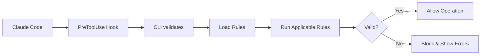

# Core Concepts

> Understand the fundamental concepts behind the Claude Code Validator framework.

## Architecture Overview

The framework consists of four main components:

1. **Validator** - Core validation engine that orchestrates rule execution
2. **Rules** - Individual validation rules that check specific patterns
3. **Auto-discovery** - System that finds and loads rules automatically
4. **CLI** - Command-line interface for running validations

## Validation Flow

When Claude Code attempts to edit or write a file:



1. Claude Code triggers a `Write` or `Edit` operation
2. The `PreToolUse` hook intercepts the operation
3. The CLI receives the operation details via stdin
4. Rules are auto-discovered from `.claude/rules/**`
5. Only applicable rules run (based on `shouldRun()`)
6. Each rule validates the content
7. If errors are found, the operation is blocked
8. Claude receives feedback and can try again

## ValidationContext

Every validation rule receives a context object with information about the operation:

```typescript
interface ValidationContext {
  toolName: string;        // 'Edit' or 'Write'
  filePath: string;        // Path to the file being modified
  content: string;         // New/current content
  oldContent?: string;     // Previous content (for Edit only)
  operation: 'edit' | 'write';
}
```

### Example Context

For an Edit operation:

```json
{
  "toolName": "Edit",
  "filePath": "src/components/MyComponent.vue",
  "content": "<template><UFormField>...</UFormField></template>",
  "oldContent": "<template><UFormGroup>...</UFormGroup></template>",
  "operation": "edit"
}
```

## ValidationRule

A validation rule is an object with four properties:

```typescript
interface ValidationRule {
  name: string;
  description: string;
  shouldRun: (context: ValidationContext) => boolean;
  validate: (context: ValidationContext) => Promise<string[]> | string[];
}
```

### name

Unique identifier for the rule. Used in logs and hook names.

```typescript
name: 'nuxt-ui'
```

### description

Human-readable description of what the rule validates.

```typescript
description: 'Validate Nuxt UI component usage and patterns'
```

### shouldRun()

Determines if this rule should run for the given context. Use this to filter by file type, path, or other criteria.

```typescript
shouldRun: (context) => {
  // Only run on Vue files
  return context.filePath.endsWith('.vue');
}
```

Common patterns:

```typescript
// File extension
shouldRun: (context) => /\.(ts|js)x?$/.test(context.filePath)

// Specific directory
shouldRun: (context) => context.filePath.startsWith('src/components/')

// Always run
shouldRun: () => true

// Multiple conditions
shouldRun: (context) => {
  return context.filePath.endsWith('.vue') &&
         context.operation === 'edit';
}
```

### validate()

The validation logic. Returns an array of error messages. Empty array means validation passed.

```typescript
validate(context) {
  const errors: string[] = [];

  if (context.content.includes('bad-pattern')) {
    errors.push(
      `❌ Found bad pattern\n` +
      `   → Use good-pattern instead\n` +
      `   📄 File: ${context.filePath}`
    );
  }

  return errors;
}
```

Can be async:

```typescript
async validate(context) {
  const errors: string[] = [];

  // Perform async operations
  const result = await someAsyncCheck(context.content);

  if (!result.valid) {
    errors.push(result.error);
  }

  return errors;
}
```

## Auto-discovery

Rules are automatically discovered from `.claude/rules/**/*.{ts,js}`:

```
.claude/rules/
├── nuxt-ui.ts           ✅ Discovered
├── define-model.ts      ✅ Discovered
├── my-rule.ts           ✅ Discovered
├── subdirectory/
│   └── another-rule.ts  ✅ Discovered
└── utils.ts             ✅ Discovered (if exports ValidationRule)
```

### Discovery Process

1. Glob pattern finds all `.ts` and `.js` files
2. Test files (`*.test.ts`, `*.spec.ts`) are ignored
3. Each file is imported dynamically
4. Exports are checked for `ValidationRule` interface
5. Valid rules are registered automatically

### Requirements

For a rule to be discovered, it must:

- Be in `.claude/rules/**`
- Have a `.ts` or `.js` extension
- Export a `ValidationRule` object
- Match the `ValidationRule` interface

Example of discoverable rule:

```typescript
import { defineCodeRule } from '../claude-code-validator';

export const myRule = defineCodeRule({
  name: 'my-rule',
  description: 'My validation rule',
  shouldRun: () => true,
  validate: () => []
});
```

## Hookable System

The validator uses `hookable` to provide lifecycle hooks:

```typescript
const validator = defineCodeValidator();
const hooks = validator.getHooks();

// Before any validation
hooks.hook('validate:before', (context) => {
  console.log('Starting validation for:', context.filePath);
});

// After all validation
hooks.hook('validate:after', (context, errors) => {
  console.log(`Found ${errors.length} errors`);
});

// For specific rule
hooks.hook('validate:my-rule', (context) => {
  console.log('Running my-rule');
});
```

## Error Format

Errors should be formatted for clarity:

```typescript
errors.push(
  `❌ Brief description of the error\n` +
  `   → Suggested fix or replacement\n` +
  `   ℹ️  Additional helpful information\n` +
  `   📄 File: ${context.filePath}`
);
```

Example output:

```
⚠️  VALIDATION ERRORS:

❌ UFormGroup is outdated. Use UFormField instead.
   → Use: UFormField
   📄 File: src/components/MyComponent.vue

❌ Invalid color "red" on <UButton>
   → Use Nuxt UI v4 semantic color: "error"
   ℹ️  Valid colors: primary, neutral, error, success, warning
   📄 File: src/components/MyButton.vue
```
